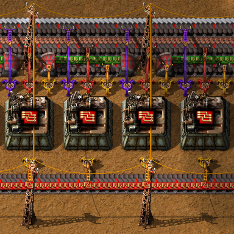

# Extra-Long-Handed-Inserter

A well integrated Factorio utility mod aimed at simplifying logistics.

## Features:
* Three tile reach: Picks up and places three tiles away, perfect for three belt input.
* Fully integrated: Complete with custom sprites, standard inserter interactions sounds, and full circuit network support.
* High performance: Built on vanilla inserter logic, won't tank UPS.
